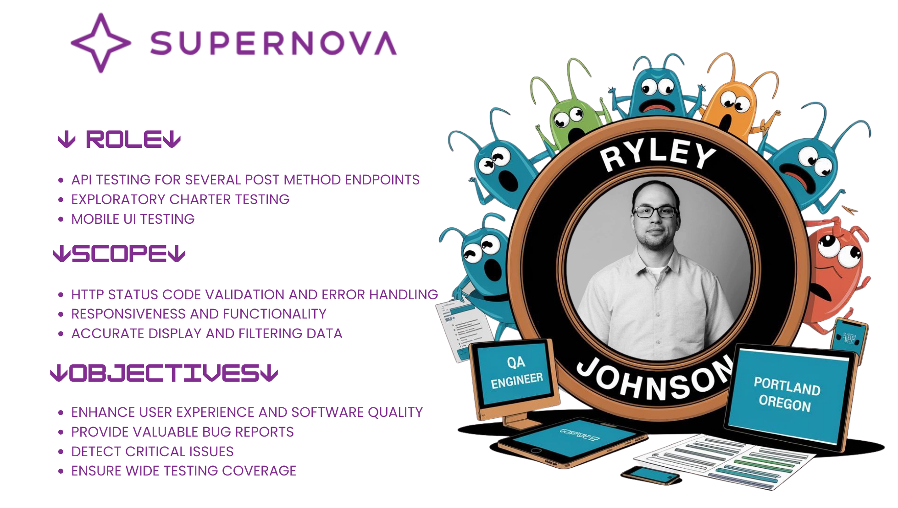

# Supernova-Internship-Test-Report
## Introduction
*I’m excited to share that I’ve just finished a 3-month internship with [Supernova MGU](https://www.linkedin.com/company/supernova-mgu/), where I significantly improved my software QA skills. Supernova is developing innovative insurance software in Canada, and I’m proud to have been part of the team that helped enhance the quality and future user experience of their product.*

*Working alongside an awesome team including [Daniel Tifft](https://www.linkedin.com/in/daniel-tifft), [Myrrh Rachel Hsu](https://www.linkedin.com/in/myrrhrachel-hsu), [Kristiana Kaila Ingco](https://www.linkedin.com/in/kristianaingco/), [Ray Grigolla](https://www.linkedin.com/in/ray-grigolla), [Michael Reasoner](https://www.linkedin.com/in/michael-reasoner-qa-engineer/), [Jezer Medina](https://www.linkedin.com/in/jezer-medina-18b3572a7/), and [Refat Ullah](https://www.linkedin.com/in/refat-ullah1999), under the mentorship of [Prashant Vaghela](https://www.linkedin.com/in/prashantvaghela) and [Jonathan Cost](https://www.linkedin.com/in/jcost), we focused on API and web/mobile UI testing. We operated in an Agile environment with daily stand-ups and weekly team meetings, as well as a final presentation to our stakeholders.*

*The internship introduced me to new tools like DrivT for project management and methodologies like charter testing/session-based testing; which greatly improved my approach to complex testing tasks. Over the course of the internship, our team executed hundreds of test cases. I developed strong organizational habits while logging extensive amounts of bug reports in Atlassian Jira by creating structured folders and applying consistent labels.*

*My API testing skills grew substantially. We tested several complex API endpoints with a focus on edge cases, valid and invalid input tests while checking HTTP validation and error handling. I learned how to fork collections and create pull requests and utilize pre and post-request test scripts in Postman.*

*Going beyond my assigned tasks, I practiced automation in my free time, converting manual API tests to automated scripts using JavaScript, Axios, and Jest. With collaboration from [Kristiana Kaila Ingco](https://www.linkedin.com/in/kristianaingco/), she taught me essential Github version control techniques and introduced me to efficient coding practices, such as importing constants and using 'before' hooks for repetitive tests. This collaboration not only sharpened my automation skills but also gave me practical experience in teamwork.*

*What I valued most was the chance to work in a professional agile environment, with a really motivated team while meeting real deadlines and expectations. The practical application of my theoretical knowledge was also super rewarding.*

*While I’m sad to see the internship end, I’m stoked about applying these new skills in my future QA career. I would like to extend my thanks to [Supernova MGU](https://www.linkedin.com/company/supernova-mgu/) and [TripleTen](https://www.linkedin.com/school/tripleten/) for this opportunity to be a part of enhancing their awesome software!*


## Tester Information
**Name:** Ryley Johnson <br>
**Date:** Aug-Oct 2024


## Video Demonstration

[](https://www.youtube.com/watch?v=KO-V_HEkh3o)
[Video Link](https://www.youtube.com/watch?v=KO-V_HEkh3o)

## Focus Areas
1. **API Testing**
   - Backend API testing for `cal_carrier_remmitance` and `ping` endpoints
2. **UI Testing**
   - Frontend exploratory testing for Leads Management/Kanban Board (broker space)
3. **UI/UX Testing**
   - Mobile device exploratory testing

## Test Results Summary

| Component                      | Total Tests | Passed | Failed | Bugs Found |
|-------------------------------|-------------|---------|---------|------------|
| Cal_carrier_remmitance        | 28          | 14      | 14      | 14         |
| Ping                          | 5           | 5       | 0       | 0          |
| Leads Management/Kanban Board | -           | -       | -       | 8          |
| Mobile UI                     | -           | -       | -       | 5          |

## Detailed Test Analysis

### Cal_carrier_remmitance API Testing
- **Endpoint Parameters:**
  - carrier_id (string, requires uppercase)
  - transaction_date (string, format: "YYYY-MM-DD")

#### Key Findings
- Most failures involved HTTP response code inconsistencies
  - Expected `HTTP 400 Bad Request`
  - Received `HTTP 500` for invalid inputs
- `transaction_date` parameter showed the most issues
- Notable edge case: Date format with misleading zeros (2024-9-01)
  - Postman: Returns `200 OK`
  - Automated testing: Returns `400 Bad Request`
  - Inconsistency remains unresolved

### Ping API Testing
- Limited test cases executed
- Potential for expansion into security testing (SQL injections)

### Leads Management/Kanban Board Testing
#### Primary Issues
- Filtering functionality problems
- Lead count discrepancies between kanban board and backlog
- Inconsistent drag-and-drop functionality

### Mobile UI Testing
#### Key Issues
- Web-app download prompt issues:
  - Pixelated app launcher icon ("Covera")
  - Multiple clicks required to launch
  - Initial `404 error` page
  - Small home link button for web-app access
- Limited testing scope due to time constraints

## Recommendations

### Technical Improvements
1. Enhance error handling for invalid requests
2. Implement user-friendly error messages
3. Conduct comprehensive mobile testing
4. Establish clear frontend functionality requirements

### Specific API Recommendations
1. **Error Response Enhancement**
   - Current issue: Complex error messages with stack traces
   - Example of current response:
   ```json
   {
      "error": "single positional indexer is out-of-bounds",
      "stackTrace": "Traceback (most recent call last):\n  File \"/home/site/wwwroot/api/calc_carrier_remittance_rate.py\", line 48, in http_trigger\n    response = temp_df.iloc[0].to_dict()\n               ~~~~~~~~~~~~^^^\n  File \"/usr/local/lib/python3.11/site-packages/pandas/core/indexing.py\", line 1191, in __getitem__\n    return self._getitem_axis(maybe_callable, axis=axis)\n           ^^^^^^^^^^^^^^^^^^^^^^^^^^^^^^^^^^^^^^^^^^^^^\n  File \"/usr/local/lib/python3.11/site-packages/pandas/core/indexing.py\", line 1752, in _getitem_axis\n    self._validate_integer(key, axis)\n  File \"/usr/local/lib/python3.11/site-packages/pandas/core/indexing.py\", line 1685, in _validate_integer\n    raise IndexError(\"single positional indexer is out-of-bounds\")\nIndexError: single positional indexer is out-of-bounds\n"
   }
   ```
   - Recommendation: Implement user-friendly error messages

2. **French Character Support**
   - Current behavior: Returns `HTTP 400` for `carrier_id` with French accents
   - Recommendation: Add support for French accented characters given Canadian service context

3. **Date Handling Logic**
   - Current issue: Inconsistent `start_date_inclu` values
   - Example: `transaction_date` of `2030-04-15` returns `start_date_inclu` of `2024-01-01`
   - ***Recommendation:*** Review and align date logic with business requirements

   - My understanding of how this API is supposed to work is somewhat limited, but based on my assumption, for example, if I set a `transaction_date` of `2030-04-15`, the `start_date_inclu` in the results should not be before that. However, when I tested this, I set the `transaction_date` to `2030-04-15`, but the API response returned a `start_date_inclu` of `2024-01-01`. Because of this assumption, I wrote a new postman pre-request and post-request script.

   Pre-Request Script:
   ```javascript 
   const requestBody = pm.request.body.raw;
   const parsedBody = JSON.parse(requestBody);
   pm.environment.set("transaction_date", parsedBody.transaction_date);
   ```

   Post-Request Script:
   ```javascript
   pm.test("Start_date_inclu is on or after the transaction_date", function () {
    const responseData = pm.response.json();
    // Retrieve transaction_date from environment variable
    const transactionDate = pm.environment.get('transaction_date');
    if (!transactionDate) {
        pm.expect.fail("transaction_date is not defined in environment variables");
    }
    // Convert to Date objects for comparison
    const startDateInclu = new Date(responseData.start_date_inclu);
    const transactionDateObj = new Date(transactionDate);
    // Ensure start_date_inclu is on or after transaction_date
      pm.expect(startDateInclu).to.be.at.least(transactionDateObj, "start_date_inclu should be on or after transaction_date");
   });
   ```
